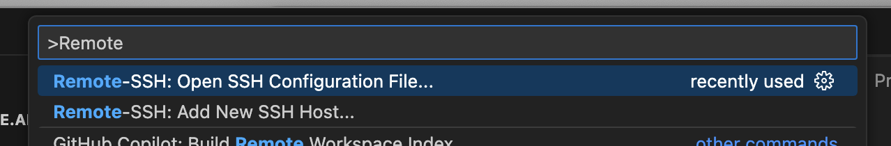
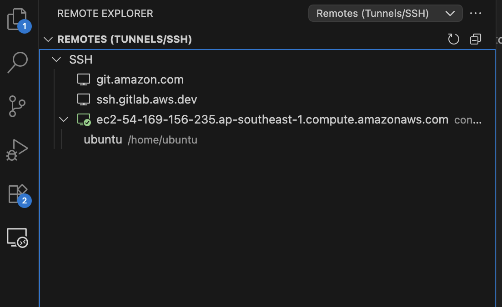
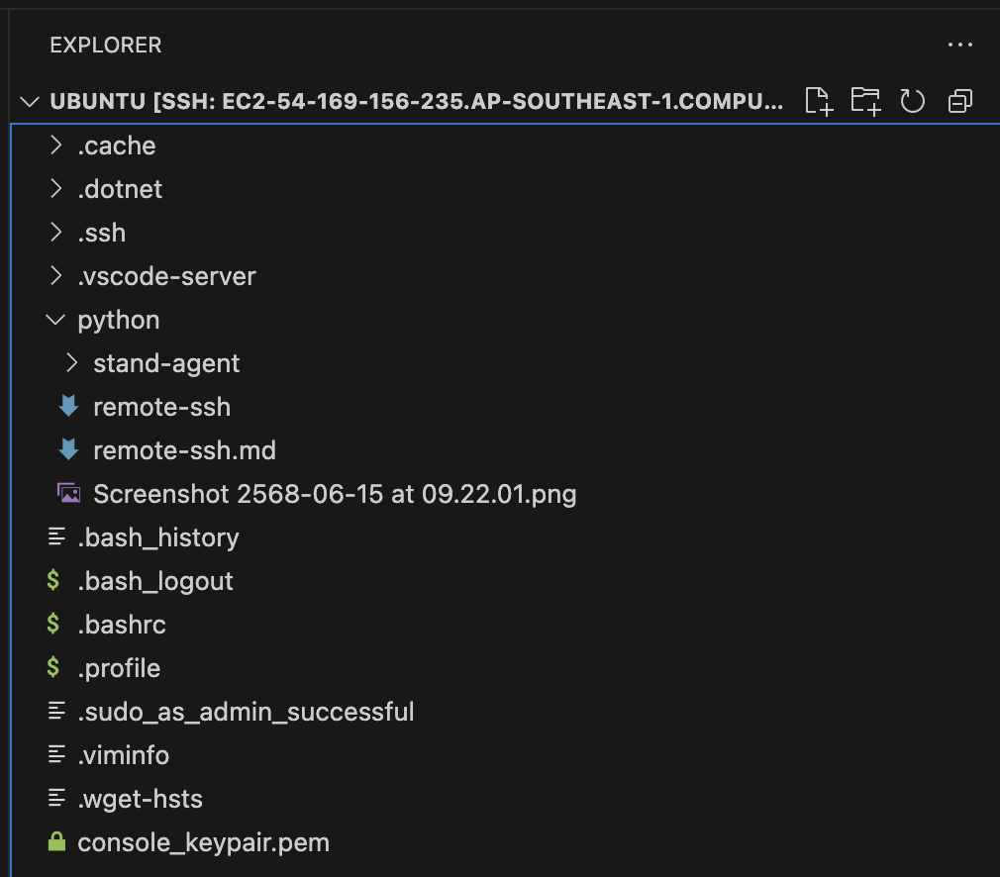

# How to remote to EC2 SSH and create virtual environment in python


## Remote to the EC2

1. In VS Code press  <kbd>Ctrl</kbd> + <kbd>Shift</kbd> + <kbd>P</kbd> and select Remote-SSH : Open SSH Configuration File

<p align="center"></p>


2. In the open file 
```
Host <EC2 FQDN hostname from EC2>
    User ubuntu
    IdentityFile /Users/<alias>/path/to/<keypair>.pem
```

3. Next is to connect to SSH host. Just select Remote Explorer and choose EC2 host that you create in 2.

<p align="center"></p>

4. Now you can see folder on remote host

<p align="center"></p>


